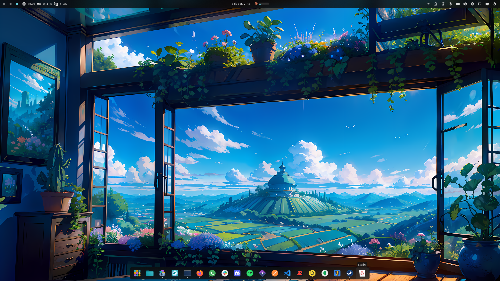

<div align="center">


# Trash

The trash, one click away, for the [COSMIC](https://system76.com/cosmic) desktop.

</div>

Trash puts the wastebasket where you can actually reach it. It sits in the COSMIC panel or dock as
a single icon that tells you, at a glance, whether anything is waiting to be thrown out.

Clicking it opens two actions and nothing else: open the trash in your file manager, or empty it.
Emptying asks first, because it cannot be undone. There is no file list, no settings and nothing to
configure — it uses the desktop's own trash and the icons your icon theme already provides.



## What it does

- Shows an empty or a full bin, and keeps up as the trash changes
- Uses the panel's symbolic glyph, and the dock's full-colour icon, like every native applet
- Opens the trash in your usual file manager
- Empties the trash, after asking
- Follows the FreeDesktop trash specification every application already shares
- Twelve languages

## Installation

### Flatpak

```sh
flatpak remote-add --if-not-exists --user cosmic https://apt.pop-os.org/cosmic/cosmic.flatpakrepo
flatpak install --user cosmic io.github.marcelogomes90.cosmic-ext-applet-trash
```

### From source

Needs a Rust toolchain and the COSMIC development dependencies.

```sh
just build-release
just install-user      # ~/.local, no root
# or
sudo just install      # /usr
```

Then add **Trash** in Settings → Desktop → Panel → Applets.

## Developing

```sh
just verify     # formatting, clippy, layering, tests, desktop entry and metainfo
just run-dump   # read the trash with no display server; --empty purges it
```

`ARCHITECTURE.md` explains how the applet is put together and why the small awkward parts are the
way they are.

## Translating

Catalogues live in `i18n/<locale>/trash.ftl`. Copy `i18n/en/trash.ftl`, translate the values, and
run `just test` — a test checks every catalogue defines exactly the English message ids and that
none of them overflows the menu.

## Contributing

Issues and pull requests are welcome. Run `just verify` before opening one.

### Packaging

A release is one `chore: release X.Y.Z` commit touching `Cargo.toml`, `Cargo.lock`, the metainfo
`<releases>` entry and the Flatpak manifest's tag, then a `vX.Y.Z` tag. Regenerate
`flatpak/*/cargo-sources.json` with `just flatpak-sources` whenever `Cargo.lock` gains a new
package.

## Licence

GPL-3.0-only. See [LICENSE](LICENSE).
